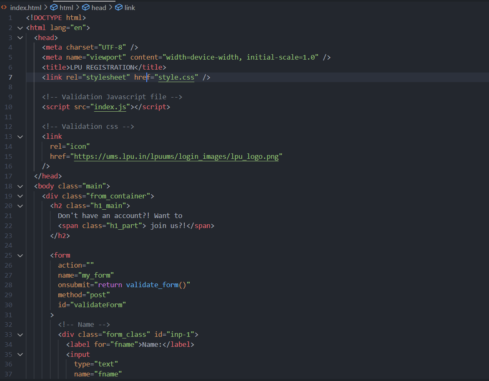
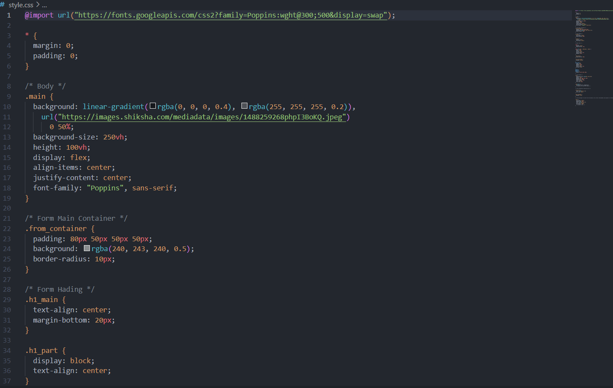
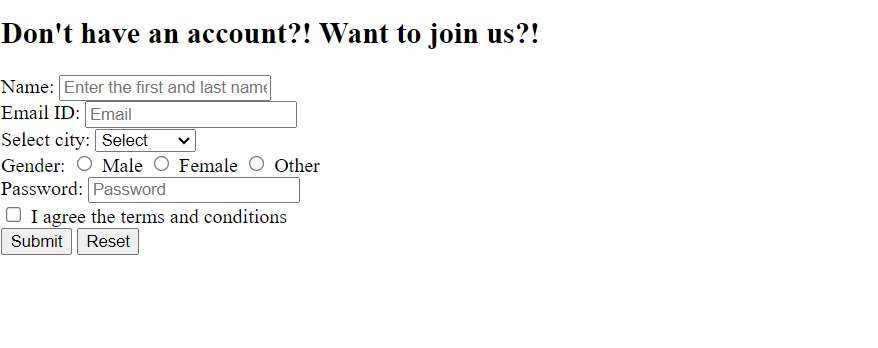
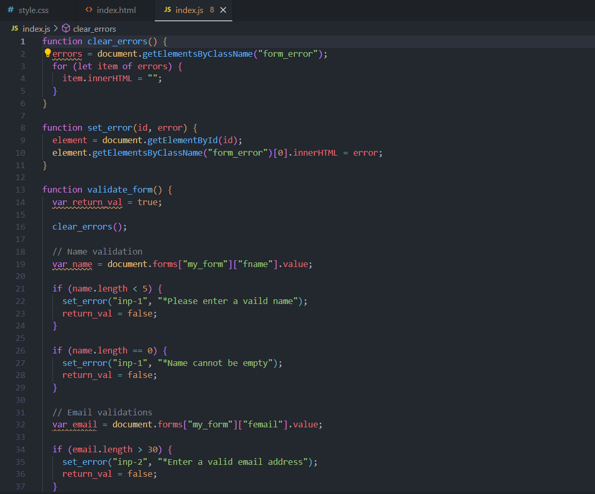
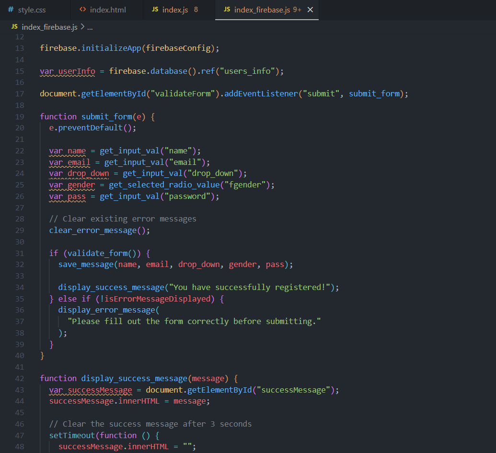
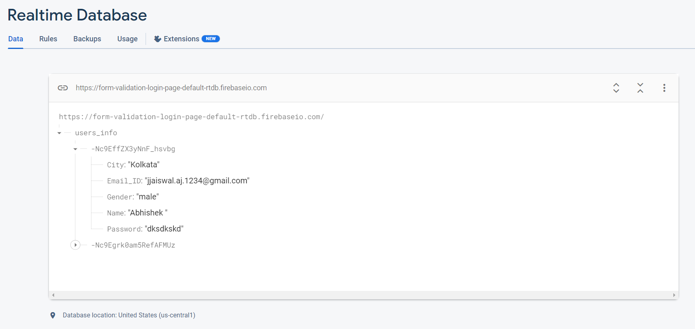

# LPU Registration Page

Welcome to the **LPU Registration Page** project repository! This web application showcases a user registration form built with HTML, CSS, and JavaScript. The project focuses on form validation, ensuring that user inputs are accurate before submission. Valid submissions are stored in Firebase for future reference.

## Table of Contents

- [Introduction](#introduction)
- [Technologies Used](#technologies-used)
- [Features](#features)
- [Screenshots](#screenshots)
  - [HTML Structure](#html-structure)
  - [CSS Styling](#css-styling)
  - [JavaScript Form Validation](#javascript-form-validation)
  - [Firebase Integration](#firebase-integration)
- [Getting Started](#getting-started)
- [Usage](#usage)
- [Contributing](#contributing)
- [License](#license)

## Introduction

The **LPU Registration Page** is a web application that simulates the registration process for Lovely Professional University (LPU). It highlights the importance of form validation to ensure accurate and complete user data submission.

## Technologies Used

- HTML5
- CSS3
- JavaScript
- Firebase

## Features

- User-friendly registration form.
- Real-time form validation using JavaScript.
- Captivating visual design using CSS.
- Storage of valid registrations in Firebase.
- Success alert on successful registration.

## Screenshots

### HTML Structure

The HTML structure provides the foundation for the registration form, incorporating necessary input fields and elements.

### CSS Styling

CSS styling brings life to the registration form, enhancing its visual appeal and user experience.

#### Styling:

##### Before Styling:

##### After Styling:

### JavaScript Form Validation

JavaScript is employed to validate user inputs in real-time, ensuring the correctness of submitted data.

##### Validation failed

##### Validation Fullfilled

### Firebase Integration

Firebase is integrated to store valid user registrations securely for future reference.

## Getting Started

To run the project locally, follow these steps:

1. Clone this repository.
2. Open the `index.html` file in your web browser.

## Usage

1. Fill out the registration form with accurate details.
2. Observe real-time validation feedback.
3. Upon successful validation, your data will be stored in Firebase.
4. A success alert will confirm your registration.

## Contributing

Contributions are welcome! Feel free to open an issue or submit a pull request for any enhancements or fixes.

## License

This project is licensed under the [MIT License](LICENSE).

---

We hope you enjoy exploring the **LPU Registration Page** project! Please feel free to contribute and provide feedback.
